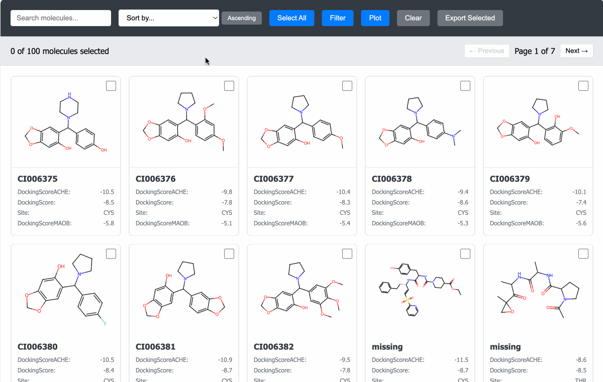

# MoleculeView.jl

[](#installation)
[](https://github.com/JuliaDiff/BlueStyle)
[](https://github.com/JuliaTesting/Aqua.jl)

A Julia library for interactive molecular data visualization and exploration. 

<table>
  <tr>
    <td></td>
    <td></td>
  </tr>
  <tr>
    <td colspan="2" align="center"></td>
  </tr>
</table>

## Installation

```julia
using Pkg
Pkg.add("MoleculeView")
```

## Quick Start

### Interactive Scatter Plot

```julia
using MoleculeView, DataFrames

df = DataFrame(
    smiles = ["CCO", "c1ccccc1", "CC(=O)OC1=CC=CC=C1C(=O)O"],
    molecular_weight = [46.07, 78.11, 180.16],
    logP = [-0.31, 2.13, 1.19],
    activity = ["active", "inactive", "active"]
)

mol_scatter(
    df,
    :smiles,
    :molecular_weight,
    :logP,
    color_col = :activity,
    markersize = 12
)
```

The interactive scatter plot displays molecules as points in 2D space, where clicking on any point shows the corresponding molecular structure. Points can be colored by categorical properties for visual grouping and analysis.

### Interactive Molecule Grid

```julia
display_mol_grid(
    df,
    mol_col = "smiles",
    id_col = "molecular_weight",
    properties = ["logP", "activity"],
    size = (300, 300),
    open_browser = true,
)
```

The molecule grid allows you to:

- Find molecules by ID or properties
- Sort by any property in ascending/descending order.
- Filter by one single or combination of properties.
- Plot the distributions of properties
- Export selected molecules as a CSV file.

## API Reference

### mol_scatter

```julia
mol_scatter(
    df::DataFrame,
    smiles_col::Symbol,
    x_col::Symbol,
    y_col::Symbol;
    color_col::Union{Symbol, Nothing} = nothing,
    molecule_size = (500, 500),
    figure_size = (1000, 500)
) 
```

Create an interactive 2D scatter plot where points represent molecules from a DataFrame.

**Arguments:**
- `df::DataFrame`: DataFrame containing molecular data
- `smiles_col::Symbol`: Column name containing SMILES strings
- `x_col::Symbol`: Column name for x-axis property
- `y_col::Symbol`: Column name for y-axis property
- `color_col::Union{Symbol, Nothing}`: Optional column name for coloring points (default: nothing)
- `molecule_size::Tuple{Int,Int}`: Size of molecule images (default 500x500)
- `figure_size::Tuple{Int,Int}`: Size of the figure
- `show_progress::Bool`: Whether to display progress bar during image generation (default: true)
- `markersize::Real`: Size of the scatter plot points (default: 12)

### display_mol_grid

```julia
display_mol_grid(
    data::DataFrame;
    mol_col = "mol",
    id_col = "id",
    properties = String[],
    size = (300, 300),
    port = 8080,
    open_browser = true,
    save_file = nothing,
    callback = nothing,
)
```

Create and display an interactive molecule grid from a DataFrame in one step.

**Arguments:**
- `data::DataFrame`: The molecular data
- `mol_col::String`: Column name containing molecule data (SMILES, etc.)
- `id_col::String`: Column name containing molecule IDs
- `properties::Vector{String}`: List of property columns to display and filter
- `size::Tuple{Int,Int}`: Size of molecule images (width, height) (default: (300, 300))
- `port::Int`: Port for local server (default: 8080)
- `open_browser::Bool`: Whether to automatically open the grid in browser (default: true)
- `save_file::Union{String,Nothing}`: Optional filename to save HTML locally (default: nothing)
- `callback::Union{Function,Nothing}`: Optional callback function (default: nothing)